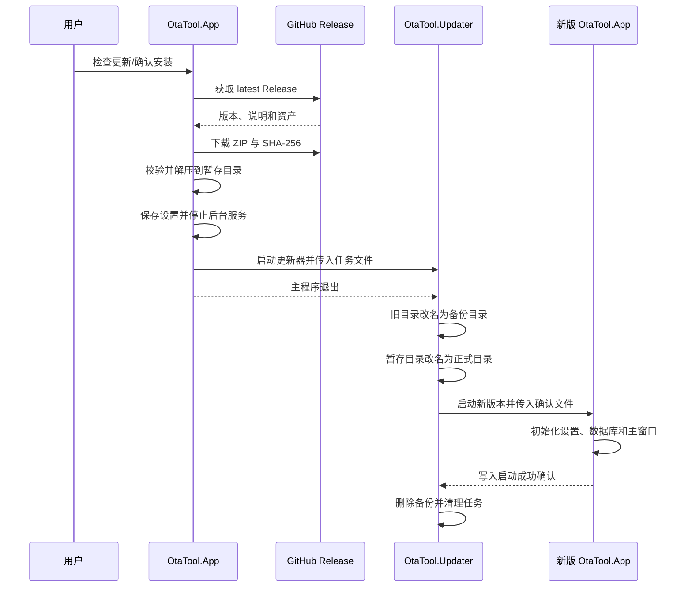

# OTA 桌面工具在线升级方案

> 文档状态：阶段一至三已实现并通过本地测试，阶段四等待 GitHub 首次发布验收
> 初始版本：`v0.1.0`
> 目标平台：Windows x64 便携版
> 源码目标目录：`D:\code\ota_tool`
> GitHub 仓库：`https://github.com/wangjingping-88/ota_tool`（公开仓库）
> 更新日期：2026-08-19

## 1. 背景与目标

OTA 桌面测试工具当前以 `win-x64` 自包含便携目录发布，版本号仍以界面固定文本为主，缺少统一的构建版本、在线检查和安全替换能力。后续工具源码将从 EcoLink 仓库中拆出，建立独立公开仓库，并使用 GitHub Release 作为版本发布和在线升级来源。

本方案目标如下：

1. 在“系统设置”页展示当前版本、构建时间、Git 提交号、更新通道和安装目录。
2. 支持启动静默检查和用户手动检查更新。
3. 从 GitHub Release 下载、校验并安装 `win-x64` 便携包。
4. 使用独立更新器完成目录替换；新版本启动失败时自动恢复旧版本。
5. 保留 MQTT 配置、Patch 配置、设备发现结果、Node 类型、历史报告和数据库等用户数据。
6. 将源码迁移到独立仓库，消除对 `D:\code\EcoLink` 固定路径的依赖。

本期不包含：

- MSIX、ClickOnce 或 MSI 安装包。
- macOS、Linux、ARM64 版本。
- 私有 GitHub 仓库鉴权。
- 应用内增量升级；每次下载完整便携 ZIP。
- 后台强制升级和无人值守自动安装。

## 2. 已确认的产品约定

| 项目 | 约定 |
|---|---|
| 源码位置 | `D:\code\ota_tool` |
| 仓库 | 公开的 `wangjingping-88/ota_tool` |
| 初始版本 | `v0.1.0` |
| 更新通道 | 仅正式稳定版，忽略 draft 和 prerelease |
| 启动检查 | 启动后静默检查，成功结果24小时内不重复请求 |
| 失败重试 | 自动检查失败后2小时再重试；手动检查不受限制 |
| 新版提示 | 每个新版本主动提示一次，关闭后在设置页保留提示 |
| 安装方式 | 下载校验后退出主程序，由独立更新器替换并重启 |
| 异常处理 | 新版本未在限定时间内确认启动成功时自动回滚 |
| 数据目录 | `%LocalAppData%\OtaTool`，不随安装目录替换 |

## 3. 源码仓库拆分

### 3.1 目标结构

```text
D:\code\ota_tool\
├─ src\
│  ├─ OtaTool.App\
│  ├─ OtaTool.Core\
│  ├─ OtaTool.Update\
│  └─ OtaTool.Updater\
├─ tests\
│  ├─ OtaTool.Core.SmokeTests\
│  └─ OtaTool.Update.Tests\
├─ scripts\
├─ assets\
│  └─ native\
├─ docs\
├─ .github\
│  └─ workflows\
└─ OtaTool.sln
```

### 3.2 迁移要求

- 将现有 `tools/ota_tool` 源码迁入新仓库并保持现有功能。
- 将 Patch 制作、Patch 还原测试和日志分析所需脚本一并迁入新仓库。
- 将 `bsdiff_cmd.exe` 等运行时资源纳入新仓库或发布资产，不再从 EcoLink 父目录引用。
- 删除源码构建期间对 `D:\code\EcoLink\tools\analyze_ota_logs.py` 等固定路径的依赖。
- 发布包必须完全自包含，在不存在 EcoLink 工作区的电脑上仍可正常运行。
- 独立仓库完成构建和发布验证前，不删除 EcoLink 中的旧源码；验证完成后再移除旧目录，并将 EcoLink 文档改为指向 GitHub Release。

## 4. 总体架构

新增两个项目：

### 4.1 `OtaTool.Update`

供主程序调用的更新业务库，负责：

- 获取 GitHub 最新正式 Release。
- 解析并比较版本号。
- 处理自动检查节流和“每版本仅提示一次”。
- 下载便携包和 SHA-256 校验文件。
- 校验资产并安全解压到暂存目录。
- 生成待安装任务文件。
- 将独立更新器准备到不会被安装目录替换的位置。

建议公开接口：

```csharp
public interface IUpdateService
{
    Task<UpdateCheckResult> CheckForUpdatesAsync(
        bool force,
        CancellationToken cancellationToken);

    Task<PreparedUpdate> DownloadAndPrepareAsync(
        UpdateReleaseInfo release,
        IProgress<UpdateDownloadProgress>? progress,
        CancellationToken cancellationToken);
}
```

核心数据模型：

- `UpdateCheckResult`：检查状态、当前版本、最新版本、错误信息。
- `UpdateReleaseInfo`：版本、发布时间、Release Notes、页面地址、资产地址、文件大小和摘要。
- `UpdateDownloadProgress`：下载阶段、已下载字节、总字节、百分比和速度。
- `PreparedUpdate`：暂存目录、安装目录、更新器路径、待安装任务文件。

### 4.2 `OtaTool.Updater`

独立的 `WinExe`，发布为 `win-x64` 自包含单文件程序，负责：

- 等待原主程序退出。
- 再次校验安装、暂存和备份目录边界。
- 以目录重命名方式切换新旧版本。
- 启动新版本并等待启动确认。
- 启动失败、超时或异常退出时恢复旧目录。
- 记录独立更新日志并清理待安装状态。

更新器运行副本放在 `%LocalAppData%\OtaTool\updates\runtime`，不得直接从即将被替换的安装目录运行。

## 5. 版本与 Release 约定

### 5.1 版本格式

- Git Tag：`vMAJOR.MINOR.PATCH`，例如 `v0.1.0`。
- Release 标记必须与应用程序集版本一致。
- 第一阶段仅接受三段稳定版本号，不接受 `v1.0.0-beta.1` 等预发布版本。
- `AssemblyInformationalVersion` 使用 `0.1.0+<git-sha>` 格式；界面显示时去掉构建元数据并添加 `v` 前缀。

### 5.2 构建信息

Release 工作流从 Tag 和 Git 提交生成：

- `Version`
- `AssemblyVersion`
- `FileVersion`
- `InformationalVersion`
- `SourceRevisionId`
- UTC 构建时间

主程序运行时从程序集元数据读取这些值，禁止继续硬编码 `v0.1.0`。

### 5.3 Release 资产名称

每个正式 Release 必须包含：

```text
OtaTool-v{version}-win-x64-portable.zip
OtaTool-v{version}-win-x64-portable.zip.sha256.txt
```

例如：

```text
OtaTool-v0.1.1-win-x64-portable.zip
OtaTool-v0.1.1-win-x64-portable.zip.sha256.txt
```

客户端按完整名称匹配资产；资产缺失、重复或名称不符时均不得进入安装阶段。

## 6. GitHub Release 检查策略

检查接口：

```text
GET https://api.github.com/repos/wangjingping-88/ota_tool/releases/latest
```

请求要求：

- 设置明确的 `User-Agent`。
- 设置 GitHub JSON Accept Header 和 REST API 版本 Header。
- 请求超时15秒。
- 不在客户端保存或内置 GitHub Token。
- 忽略 draft、prerelease 和非法版本 Tag。

检查结果：

- 最新版本大于当前版本：返回可更新状态。
- 最新版本等于或小于当前版本：显示“当前已是最新版本”。
- API、网络、JSON 或资产校验失败：返回可诊断错误，不影响工具其他功能。
- 自动检查失败仅写日志和更新设置页状态，不弹错误窗口。
- 手动检查失败在设置页显示明确错误和重试入口。

节流状态保存在 `%LocalAppData%\OtaTool\updates\state.json`，至少包括：

```json
{
  "lastSuccessfulCheckUtc": null,
  "lastFailedCheckUtc": null,
  "lastPromptedVersion": null
}
```

## 7. 系统设置页面

在现有“系统设置”页增加“版本与更新”卡片，保持页面左右区域宽度和现有视觉规范一致。

### 7.1 基本信息

卡片显示：

- 当前版本。
- UTC 构建时间。
- Git 短提交号。
- 更新通道：正式版。
- 当前安装目录。
- 最近检查时间。
- 最新可用版本。

### 7.2 检查更新

- 提供“检查更新”按钮。
- 检查期间按钮禁用，并显示“正在检查”。
- 发现新版本时显示版本号、发布时间和“查看更新”入口。
- 自动检查发现新版本时，每个版本只主动弹出一次更新详情窗口。
- 用户关闭窗口后，设置页继续显示新版本标识；手动检查可重新打开详情。

### 7.3 更新详情与进度

更新详情窗口展示：

- 当前版本和目标版本。
- 发布时间和文件大小。
- GitHub Release Notes。
- “稍后”“打开 Release 页面”“下载并安装”三个操作。

下载窗口展示：

- 当前阶段：下载、校验、解压、准备安装。
- 已下载字节、总字节、百分比和下载速度。
- 下载与校验阶段允许取消。
- 更新器启动后不再提供取消操作。

## 8. 下载、校验与解压

更新缓存目录：

```text
%LocalAppData%\OtaTool\updates\
├─ downloads\
├─ jobs\
├─ runtime\
├─ logs\
└─ state.json
```

校验顺序：

1. 检查 HTTP 状态和实际下载长度。
2. 检查 Release API 返回的资产大小。
3. 计算 ZIP 的 SHA-256。
4. 校验 GitHub 资产 `digest` 中的 SHA-256。
5. 下载并校验 `.sha256.txt` 中记录的 SHA-256。
6. 任一校验失败时删除 ZIP 和暂存目录，不生成安装任务。

解压要求：

- 拒绝绝对路径、盘符路径和包含 `..` 的 ZIP 条目。
- 解压后的规范化路径必须位于暂存根目录内。
- 必须存在 `OtaTool.App.exe` 和 `OtaTool.Updater.exe`。
- 必须包含 Patch 制作、还原测试和日志分析所需资源。
- 暂存目录与目标安装目录必须位于同一卷，保证目录切换可使用原子重命名。

## 9. 安装与自动回滚

### 9.1 安装流程



主程序在启动更新器前必须：

1. 阻止启动新的升级任务。
2. 保存当前配置。
3. 停止 OTA 状态轮询。
4. 停止 MQTT Client、内置 Broker 和 HTTP 服务。
5. 关闭报告数据库等文件句柄。
6. 启动更新器后正常退出。

### 9.2 启动确认

新程序使用以下形式接收确认文件：

```text
OtaTool.App.exe --update-confirm <confirmation-file>
```

新程序完成以下动作后才能写入确认文件：

- 设置加载完成。
- 数据库初始化完成。
- 主窗口完成加载，并执行一次 UI Dispatcher 空闲回调。

不要求 MQTT、Broker 或 HTTP 服务连接成功，否则外部网络故障可能导致错误回滚。

### 9.3 回滚条件

更新器等待原进程退出的上限为30秒，等待新程序启动确认的上限为60秒。出现以下任一情况时执行回滚：

- 原进程未按时退出。
- 目录切换失败。
- 新程序无法启动。
- 新程序在确认前退出。
- 60秒内未生成有效确认文件。

回滚时终止尚未确认的新进程，移除失败的新目录，恢复备份目录，并重新启动旧版本。

## 10. 路径与数据安全

- 安装目录通过当前可执行文件位置解析，不使用固定盘符。
- 更新器拒绝把磁盘根目录、用户目录或 `%LocalAppData%\OtaTool` 作为安装目录。
- 暂存和备份目录必须是安装目录的同级隐藏目录，名称包含任务 ID，避免误操作其他目录。
- 更新任务文件保存规范化后的绝对路径，并在更新器中再次验证父子关系。
- 设置、SQLite 报告库、日志和更新状态全部位于 `%LocalAppData%\OtaTool`，不参与安装目录替换。
- 安装目录不可写、路径不安全或更新器缺失时，禁用“下载并安装”，只允许打开 Release 页面手动处理。
- 更新成功后清理旧下载和暂存目录；仅保留最近一次更新日志。

## 11. GitHub Actions 发布流程

新增 `release.yml`：

1. 由 `v*` Tag 或手动工作流触发。
2. 验证 Tag 是否符合 `vMAJOR.MINOR.PATCH`。
3. 恢复依赖并运行全部测试。
4. 发布 `OtaTool.App`：`win-x64`、self-contained、非单文件便携目录。
5. 发布 `OtaTool.Updater`：`win-x64`、self-contained、single-file、`WinExe`。
6. 将更新器、脚本、原生差分程序和必要资源复制到应用发布目录。
7. 对发布目录执行包内容检查。
8. 生成便携 ZIP 和 `.sha256.txt`。
9. 先创建 Draft Release 并上传全部资产，资产齐全后再发布正式 Release。

初始发布步骤：

1. 发布 `v0.1.0`，作为具备在线升级能力的安装基线。
2. 安装并保存一套真实用户配置。
3. 发布 `v0.1.1`，验证完整在线升级和数据保留。
4. 人为制造一次新版启动确认失败，验证自动回滚。

## 12. 测试方案

### 12.1 更新服务单元测试

- 合法和非法版本号解析。
- 当前版本低于、等于、高于最新版本。
- draft、prerelease 和非法 Tag 过滤。
- 正式 Release 缺少 ZIP 或 SHA-256 资产。
- 成功检查24小时节流。
- 失败检查2小时节流。
- 手动检查强制绕过节流。
- HTTP 超时、非成功状态、无效 JSON 和离线场景。

### 12.2 下载与安全测试

- 正确 ZIP 下载和双重 SHA-256 校验。
- 文件大小、GitHub digest 或校验文件任一不匹配。
- 被篡改或残留的缓存文件不得复用。
- ZIP 路径穿越、绝对路径和关键文件缺失。
- 校验失败后缓存、暂存目录和任务文件均被清理。

### 12.3 更新器集成测试

- 临时目录中的成功替换和启动确认。
- 原进程退出超时。
- 目录不可写和路径越界。
- 新程序启动失败、提前退出和确认超时。
- 回滚后旧文件完整恢复且旧程序重新启动。
- 更新成功后备份、暂存和待安装任务被清理。

### 12.4 UI 与数据验收

- 系统设置页版本信息来自程序集元数据。
- 自动检查失败不阻塞主窗口。
- 每个新版本只主动提示一次，手动检查可重复查看。
- 下载取消后按钮和状态恢复正常。
- 更新前后的 MQTT 配置、Patch 名称、设备发现结果、Node 类型、历史报告和数据库均保持一致。

## 13. 实施顺序与验收门槛

### 阶段一：仓库拆分

- 创建 `D:\code\ota_tool` 并迁移源码、脚本和资源。
- 清除 EcoLink 固定路径依赖。
- 在独立目录完成现有功能构建和冒烟测试。

验收门槛：不依赖 EcoLink 工作区即可发布并运行完整工具。

实施结果（2026-08-19）：

- 已创建 `D:\code\ota_tool`，并初始化本地 Git 仓库；未创建远端、未提交代码。
- 已按 `src`、`tests`、`scripts`、`assets/native`、`docs` 和 `.github/workflows` 拆分目录。
- Patch 还原脚本、日志分析脚本和 `bsdiff_cmd.exe` 已改为独立仓库内相对路径引用。
- 已移除应用运行时对 `D:\code\EcoLink` 的固定路径依赖。
- 已在独立目录完成 Release 构建和核心冒烟测试，结果为 0 个错误、测试全部通过。
- EcoLink 内原 `tools/ota_tool` 暂时保留，待后续阶段和独立发布持续验证后再清理。

### 阶段二：版本和检查更新

- 实现程序集版本元数据。
- 增加系统设置页版本卡片。
- 实现 GitHub Release 检查、节流和提示策略。

验收门槛：能够区分最新版、可升级、网络失败和 Release 不完整。

实施结果（2026-08-19）：

- 已由程序集元数据提供版本、UTC 构建时间和 Git 提交号，移除界面硬编码版本。
- 已增加系统设置页在线升级卡片、启动静默检查、手动强制检查和每版本一次提示。
- 已实现 latest stable Release 解析、24 小时成功节流、2 小时失败节流和可诊断错误状态。

### 阶段三：下载和更新器

- 实现下载、双重校验、安全解压和更新任务。
- 实现独立更新器、启动确认和自动回滚。

验收门槛：临时目录集成测试覆盖成功与全部回滚分支。

实施结果（2026-08-19）：

- 已实现资产大小、GitHub digest 和 SHA-256 文件三项一致性检查，以及安全 ZIP 解压。
- 已实现独立更新器、同卷目录切换、30 秒旧进程退出等待、60 秒新版确认和自动回滚。
- 已增加在线升级测试工程，覆盖版本、节流、下载准备、ZIP 越界、启动确认、成功切换和超时回滚。

### 阶段四：Release 闭环

- 建立公开 GitHub 仓库和发布工作流。
- 发布 `v0.1.0` 与 `v0.1.1`。
- 完成真实在线升级、数据保留和回滚验收。
- 验证完成后再清理 EcoLink 中的旧源码和旧发布入口。

当前进度（2026-08-19）：`release.yml` 和发布脚本已就绪；公开远端仓库、首次推送及 `v0.1.0`/`v0.1.1` 真实升级闭环尚待执行。

## 14. 参考资料

- GitHub Releases REST API：<https://docs.github.com/en/rest/releases/releases>
- GitHub Release 管理：<https://docs.github.com/en/repositories/releasing-projects-on-github/managing-releases-in-a-repository>
- 参考实现：`D:\code\serial-log\src\SerialLog.Update`
- 参考更新器：`D:\code\serial-log\src\SerialLog.Updater`

## 15. 文档修订记录

| 日期 | 版本 | 说明 |
|---|---|---|
| 2026-08-18 | v1 | 完成独立仓库、GitHub Release、设置页版本信息、自动安装和失败回滚方案定稿 |
| 2026-08-19 | v2 | 完成阶段一独立仓库迁移、路径解耦、Release 构建与核心冒烟验证 |
| 2026-08-19 | v3 | 完成在线检查、下载校验、独立更新器、启动确认、自动回滚、测试和 Release 工作流实现 |
